# Fiscal Sheet for a Medieval Lord: Demesne, Realm, Tithes and Taxes

Oct 9, 2026 · @Alex

In an ordinary year Winterfell takes in 273,168 GD of cash after its estates pay their running costs. It spends 11,450 GD on household and works, sends 40,975 GD to the Crown, and keeps 220,743 GD. This sheet follows each dragon from the farm that earned it to the account that holds it.

## How to use this sheet

This sheet keeps the books of one great lord, House Stark of Winterfell, through one ordinary year, 126 AC. Each section opens with its point and then shows the figures behind it.

Colour means the same thing in every chart. Blue is tribute, paid up the chain to a higher lord. Grey is everything else, and the dark bar marks the one thing a chart is about. Green and red appear only in the grain account, for grain added and grain used.

Every figure is a simulation choice, not a record: the setting supplies the houses and their allegiances, and the model supplies the numbers. Money is in gold dragons (GD), with 210 silver stags to the dragon and 56 copper pennies to the stag. Grain is in quarters of 8 bushels. Time is in moons, about 30 days each, twelve to the year.

| Layer | What it covers | Sections |
| --- | --- | --- |
| All levels together | Flows between every party, the trade account, tribute and deficits | The money map; Account by level |
| The demesne | The share of each estate's farm output the lord works in hand: grain, stock, hired labour | The lordship at a glance; The demesne; Demesne income and production costs; Where the harvest went |
| The wider realm | Tenants' rents, leases, mills, markets and courts on Winterfell's 12 estates, and the 51 houses beneath it | The wider realm; Profits of lordship |
| Church dues | No general tithe in the North: godswood upkeep, alms and septon support instead | Tithes and church revenues |
| Crown and bannermen | Tribute from 35 bannermen up to Winterfell, Winterfell's payment to the Crown, royal port customs | Tributes and taxes |
| Outgoings and balance | Household, castle, works, the audited account, calendar, risk | Household, castle and works; The annual account; The seasonal calendar; Risk, deficits and contingency |

Three rules keep the sheet honest:

1. Charge and discharge. Everything received is charged to the lord, everything paid out is discharged, and the difference is the balance carried forward.
2. Count each dragon once. Rents, tribute and Crown payments move output from one hand to another; they are never added to output.
3. Keep owed coin apart from coin in the chest. What is due, what is paid and what stays owing are three figures, and arrears are a receivable, not cash.

## The money map

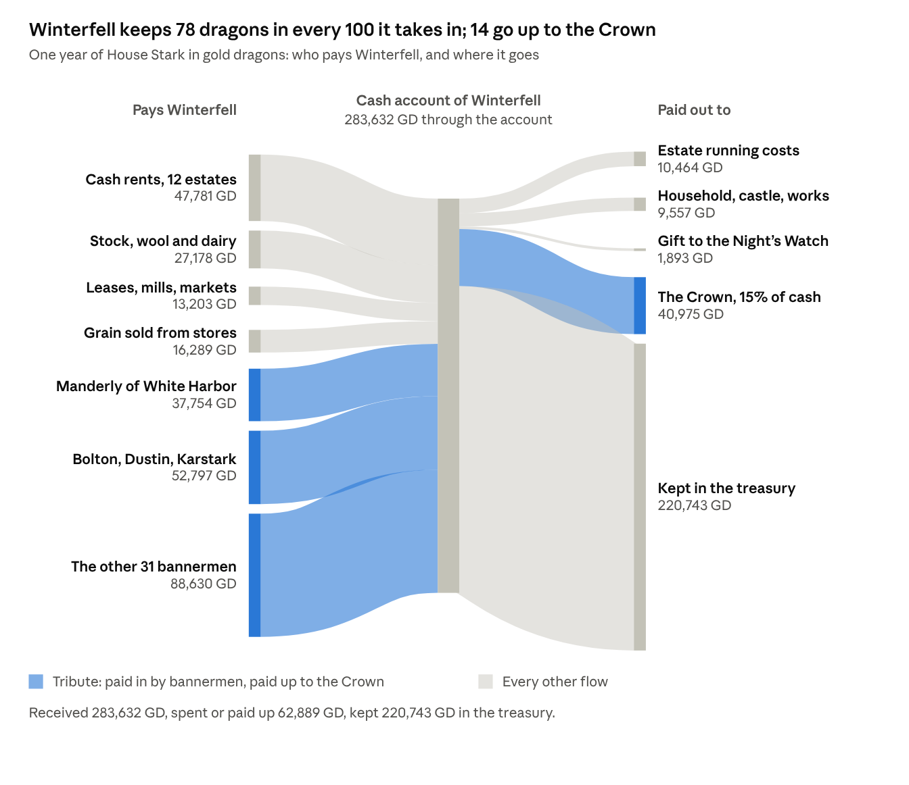

House Stark, one year · cash only; grain moves in quarters and is not drawn (see the grain account).

Read left to right. Winterfell takes in 283,632 GD: 179,181 GD of tribute from 35 bannermen, 47,781 GD of tenants' rents, and 56,670 GD from its own stock, leases and grain. Tribute is 63 percent of the inflow. Of the whole, 220,743 GD stays in the treasury, 40,975 GD goes to the Crown, and 21,914 GD pays for the estates, the household and the Night's Watch gift.

The Crown also takes 58,035 GD of royal customs at six ports. That money never passes through a house's account, so it is not drawn here; it appears in the Crown's receipts under Tributes and taxes.

## The money map for one moon

The workbook counts a year, not a moon, so the moon figures here are the year cut into pieces. A moon is about 30 days and twelve make a year. The sheet fixes one thing: the bannermen and the Crown are paid in two instalments, 60 percent and then 40 percent. It gives no dates for them. I put the instalments in moons 4 and 10, six moons apart, and spread everything else evenly over the twelve. Move the instalments and the yearly totals do not change.

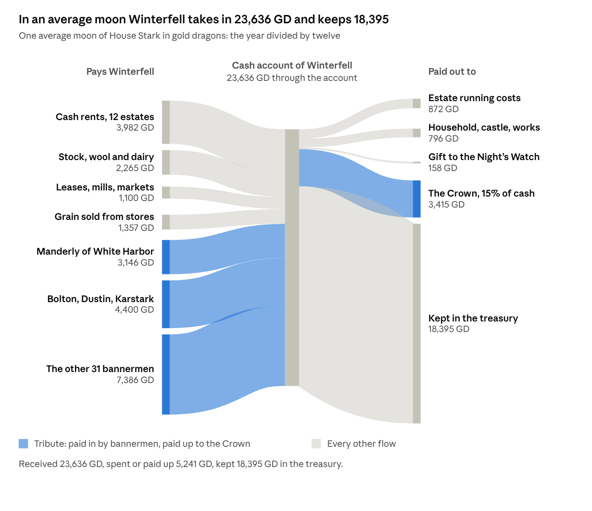

House Stark, one average moon, GD · the yearly money map divided by 12.

This is the year divided by twelve. It is true on average and wrong in almost every actual moon, because the bannermen do not pay every moon.

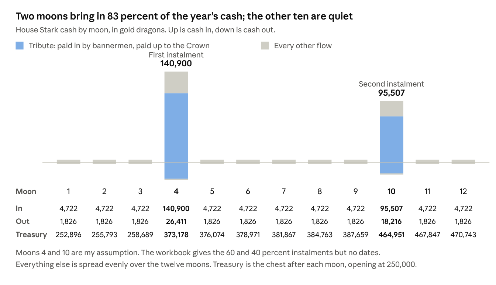

House Stark, by moon, GD · instalment moons are my assumption.

Two moons bring in 83 percent of the year's cash. The other ten bring in about 4,700 GD each and spend about 1,800, so every quiet moon still adds about 2,900 GD to a chest that opens the year at 250,000.

Per moon, in gold dragons. Out is costs plus the Crown. Kept is what is added to the treasury. Rows are rounded and may differ by 1.

| Kind of moon | Cash in | Cash out | Kept |
| --- | --- | --- | --- |
| Average moon, the year divided by 12 | 23,636 | 5,241 | 18,395 |
| Quiet moon, 10 of them | 4,722 | 1,826 | 2,896 |
| First instalment moon, moon 4 | 140,900 | 26,411 | 114,489 |
| Second instalment moon, moon 10 | 95,507 | 18,216 | 77,291 |

The Crown is paid at the instalments, not every moon: 24,585 GD in moon 4 and 16,390 GD in moon 10.

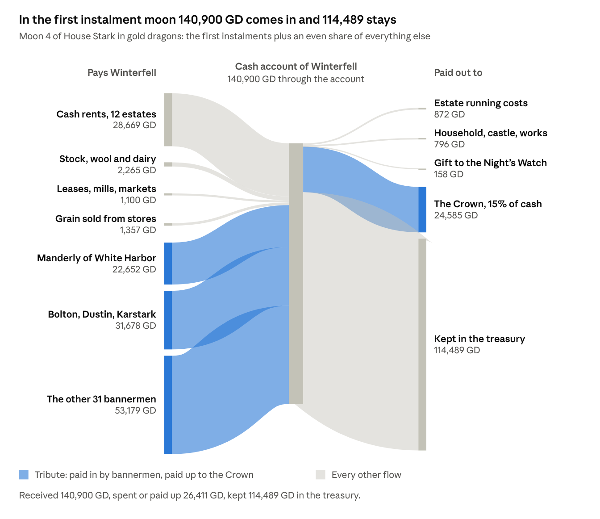

House Stark, first instalment moon (moon 4), GD.

In the first instalment moon, 76 percent of the cash that comes in is tribute, and 93 percent of what goes out is the Crown's share.

## Account by level

Every party in the chain keeps its own account. The table runs from the estates that earn the money, up through the houses, to the Crown, and shows what each level receives, spends, passes up and keeps.

| Level | Cash received | Running and household costs | Paid to the level above | Kept in treasury |
| --- | --- | --- | --- | --- |
| 163 estate receivers, 800,000 households | 983,004 | 114,020 | 868,984 to their houses | 0 |
| 16 sub-vassal houses | 85,446 | 11,784 | 13,559 to five overlords | 60,104 |
| 35 direct bannermen | 858,082 | 90,925 | 179,181 to Winterfell | 587,975 |
| Winterfell (House Stark) | 273,168 | 11,450 | 40,975 to the Crown | 220,743 |
| The Crown, from the North | 99,010 | not in the sheet | none | not in the sheet |

All figures are GD for one year. Tribute is counted once as paid by the lower house and once as received by the higher one, so the columns do not add across levels. Only the last column does: 60,104 + 587,975 + 220,743 = 868,822 GD. The Crown's 99,010 GD is Winterfell's 40,975 GD plus 58,035 GD of royal customs. Figures are rounded, so a row may differ by 1.

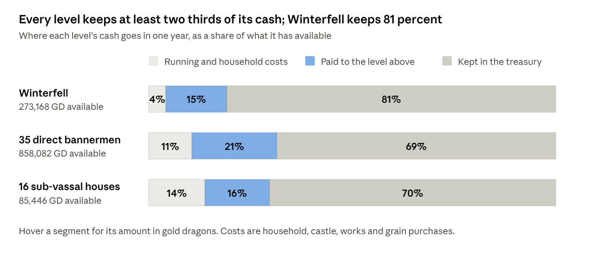

House Stark and its bannermen, one year · House Accounts sheet.

Blue is tribute, the same blue as the money map. The share paid up is 15 to 21 percent at every level; the rest is costs and the surplus kept.

### The trade account

Winterfell is also a trader. It sells stock, grain, timber and fish, and pays for the labour and gear that produce and carry them. The sheet does not split estate costs between rents and trade, so this account sets all of them against trade receipts, the cautious reading.

| Trade account, Winterfell | GD |
| --- | --- |
| Livestock, wool and dairy, the lord's share | 27,178 |
| Grain sold from the granaries (236,735 quarters) | 16,289 |
| Timber leases | 3,809 |
| Fishery leases | 1,064 |
| Trade receipts | 48,340 |
| Permanent farmworkers (3,411) | 1,937 |
| Seasonal harvest labour (341,080 worker-days) | 659 |
| Replacement oxen and sheep | 1,851 |
| Ploughs, tools, sacks, carts and harness | 4,521 |
| Cartage and store labour | 1,292 |
| Receivers and tally clerks | 204 |
| Trade expenses | 10,464 |
| Trade surplus | 37,876 |

The surplus after all estate costs is 37,876 GD; Winterfell buys no grain. Across the whole North the sheet sells 1,347,318 quarters of grain abroad for 96,596 GD and imports none.

### The deficits

No house in the sheet runs a cash deficit: every treasury ends the year higher than it began. The shortfalls that do appear are arrears, coin and grain owed but not yet paid. Risk, deficits and contingency tests four ways a real deficit could open.

1. Tenants' rents. Tenants across the North owe 16,332 GD of cash rent after the lawful remission, 949 GD of it on Winterfell's 12 estates, and 20,191 quarters of grain rent, 1,478 of them at Winterfell.
2. Bannerman tribute. Winterfell's 35 bannermen owe 181,571 GD and pay 179,181 GD. The 2,390 GD left owing is 1.3 percent, the most from Manderly (381) and Umber (316).
3. Grain. Winterfell sells 236,735 quarters and still closes with 71,879; no tenant or house closes with negative grain.

## The lordship at a glance

Winterfell's own estates hold 72,480 of the North's 800,000 households, 9 percent, yet Winterfell is paid by the other 91 percent through its bannermen. The table sets the demesne lord's own lands beside the whole realm.

| Item | Winterfell's 12 estates | The North, 163 estates | Winterfell's share |
| --- | --- | --- | --- |
| Households | 72,480 | 800,000 | 9.1% |
| People (5 per household) | 362,400 | 4,000,000 | 9.1% |
| Rural households | 68,216 | 742,667 | 9.2% |
| Sown acres (14 per rural household) | 955,024 | 10,397,338 | 9.2% |
| Gross harvest, quarters | 1,134,482 | 11,405,588 | 9.9% |
| Permanent estate workers | 3,411 | 37,137 | 9.2% |
| Output, value added (GD) | 297,412 | 3,300,000 | 9.0% |
| Gross cash to the lords (GD) | 88,162 | 983,004 | 9.0% |
| Houses | 1 | 52 |  |

The North is the poorest region in the sheet: 3,300,000 GD a year, against 9,000,000 for the Reach and 5,400,000 for the Westerlands. Dorne ranks second at 7,500,000 and pays the Crown nothing. These regional figures are simulation assumptions.

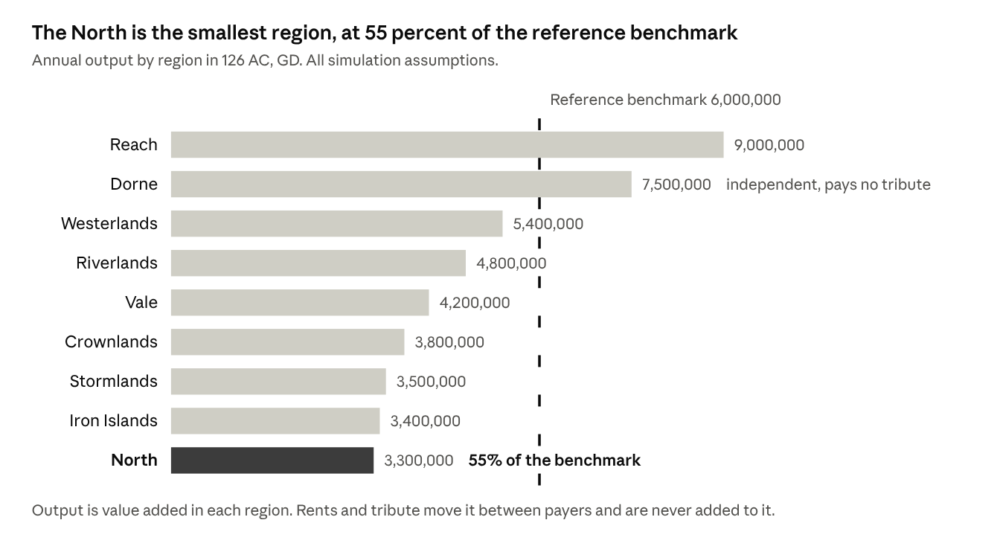

North and the other regions, 126 AC, GD · Regional GDP 126 sheet.

The dark bar is the North. The dashed line is the 6,000,000 GD reference output that the workbook scales the North against. The Westerlands bar sits below the line at 5,400,000 because the sheet applies a factor of 0.9 for 126 AC.

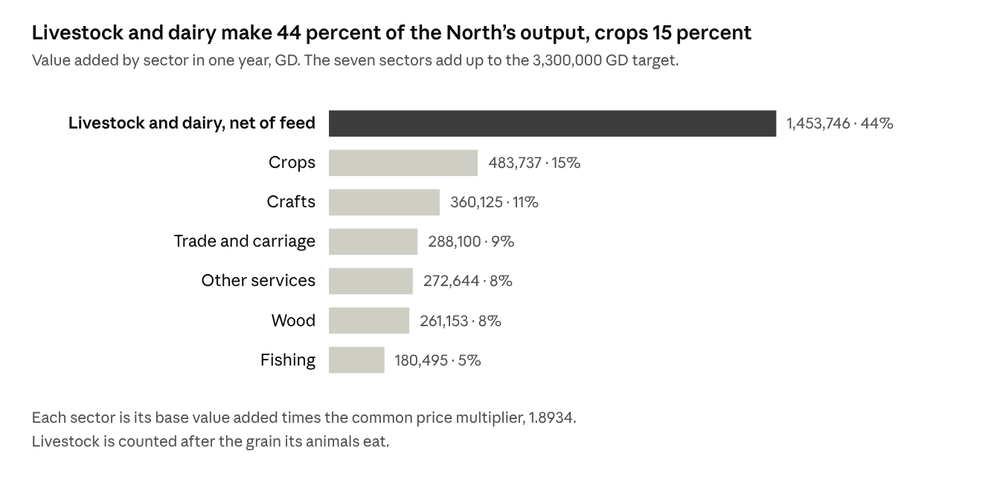

The North, one year, GD · Economy sheet, base value added times the price multiplier.

Livestock and dairy are 44 percent of what the North produces and crops are 15 percent. That mix is the workbook's own, and it is kept unchanged here.

Two houses beneath Winterfell hold more households than its own estates: Manderly of White Harbor with 99,661 and Bolton of the Dreadfort with 77,011. Dustin of Barrowton, with 54,360, comes next. Winterfell's strength is the right to tribute, not the size of its home farms.

## Money, weights and measures

The sheet counts money in three coins and grain in one measure. Every account is in gold dragons (GD) for cash and in quarters for grain, and the two are never added together.

| Unit | Equals | Note |
| --- | --- | --- |
| Copper penny | 1/56 of a stag | The smallest coin; 11,760 to the dragon |
| Silver stag | 56 pennies, 1/210 of a dragon | Wages and rents are quoted in stags |
| Gold dragon (GD) | 210 stags, 11,760 pennies | The unit of every cash account in this sheet |
| Bushel | 1/8 of a quarter | Dry measure for grain |
| Quarter | 8 bushels | The unit of every grain account; a bushel of oats weighs 32 lb, barley 48, rye 56, peas and beans or wheat 60 |
| Sown acre | Land sown in the year | Excludes fallow and grazing; 14 per rural household |
| Stone of 14 lb | A weight | Wool, dairy at milk-equivalent weight and preserved fish are counted by the stone |
| Cartload | A load | Dressed timber, delivered locally |

Every price comes from one schedule, fixed in silver stags and converted to dragons at one common scale. The scale, 1.8934, is set so that the North's output comes to 3,300,000 GD, which is 55 percent of the 6,000,000 GD Westerlands benchmark. Quantities such as households, acres and quarters do not move with it. A year's cash pay for a foot retainer, 3.79 GD, buys 60 quarters of rye.

| Item | Unit | GD | Silver stags |
| --- | --- | --- | --- |
| Rye | quarter | 0.063 | 13.3 |
| Barley | quarter | 0.072 | 15.1 |
| Oats | quarter | 0.045 | 9.5 |
| Peas and beans | quarter | 0.090 | 18.9 |
| Wheat | quarter | 0.108 | 22.7 |
| Permanent farmworker, cash pay (grain extra) | year | 0.568 | 119.3 |
| Foot retainer, cash pay (grain extra) | year | 3.787 | 795.2 |
| Mounted retainer, cash pay (grain extra) | year | 7.573 | 1,590.4 |
| Steward | year | 18.934 | 3,976.1 |
| Slaughter cattle | head | 1.325 | 278.3 |
| Replacement working ox | head | 0.947 | 198.8 |
| Breeding sheep | head | 0.316 | 66.3 |
| Dressed timber | cartload | 0.379 | 79.5 |
| Timber granary, 1,000 quarters | building | 189.34 | 39,760.6 |
| Stone curtain wall | 10-yard section | 284.00 | 59,640.9 |
| Coastal cargo vessel, about 100 tons | hull and rig | 1,893.36 | 397,606.1 |
| Cash gift to the Night's Watch | year | 1,893.36 | 397,606.1 |

## The demesne

The demesne is the fifth of each estate's farm output that the lord keeps; tenants hold the other four fifths. On Winterfell's 12 estates that is 226,896 of 1,134,482 quarters of grain a year. The sheet divides output, not fields, so it names no demesne acreage.

| Estate | District | Households | Sown acres | Permanent workers |
| --- | --- | --- | --- | --- |
| Winterfell home farms | Lowland | 10,014 | 131,782 | 471 |
| Winter Town plots | Town | 500 | 2,100 | 8 |
| East meadow villages | Lowland | 7,510 | 98,826 | 353 |
| West meadow villages | Lowland | 5,946 | 78,246 | 279 |
| Upper White Knife farms | Lowland | 8,449 | 111,188 | 397 |
| Kingsroad northern holdings | Lowland | 4,694 | 61,768 | 221 |
| Kingsroad southern holdings | Lowland | 6,259 | 82,362 | 294 |
| Western woodland leases | Forest | 6,884 | 93,478 | 334 |
| Northern sheepwalks | Upland | 5,007 | 68,698 | 245 |
| Southern cattle country | Lowland | 7,197 | 94,710 | 338 |
| Mill and bridge villages | Lowland | 5,633 | 74,130 | 265 |
| Winterfell outlying farms | Lowland | 4,387 | 57,736 | 206 |
| Total |  | 72,480 | 955,024 | 3,411 |

Nine estates are lowland, one is forest, one upland and one is the town of Winter Town. The estate names are constructed for the simulation; each is a group of villages, fields and leases under one receiver.

| Crop | Sown acres | Gross harvest (q) | Demesne harvest (q) | Demesne seed (q) | Demesne loss (q) | To the granary (q) |
| --- | --- | --- | --- | --- | --- | --- |
| Rye | 295,855 | 314,049 | 62,810 | 14,793 | 3,140 | 44,877 |
| Barley | 230,647 | 308,812 | 61,762 | 17,299 | 3,088 | 41,375 |
| Oats | 212,853 | 277,461 | 55,492 | 21,285 | 2,775 | 31,432 |
| Peas and beans | 131,710 | 142,511 | 28,502 | 6,585 | 1,425 | 20,492 |
| Wheat | 83,959 | 91,649 | 18,330 | 4,198 | 916 | 13,216 |
| Total | 955,024 | 1,134,482 | 226,896 | 64,160 | 11,345 | 151,391 |

Seed takes 28 percent of the demesne harvest and storage and harvest loss another 5 percent, so 151,391 quarters, 67 percent, reach the granary. Rows are rounded; the total is rounded from the exact figures.

| Labour and stock the demesne needs | Quantity | Rule in the sheet |
| --- | --- | --- |
| Permanent farmworkers | 3,411 | 0.05 per rural household |
| Seasonal harvest labour | 341,080 worker-days | 5 days per rural household |
| Replacement oxen | 819 head a year | 0.012 per rural household |
| Replacement sheep | 3,411 head a year | 0.05 per rural household |
| Receivers and tally clerks | 54 | One per estate, one more for each 1,500 households |

Permanent workers draw grain through the lord's granary in addition to their cash pay. Seasonal labour is paid in cash only.

## Demesne income and production costs

The demesne earns cash from the lord's one-fifth share of livestock, wool, dairy and timber, and 12 percent of the fisheries. Its grain comes in kind and is accounted separately. The estates then pay their own running costs before anything is sent to Winterfell.

| Product | Annual output | Output value (GD) | Lord's share or lease rate | To the lord (GD) |
| --- | --- | --- | --- | --- |
| Slaughter cattle | 23,876 head | 31,644 | 20% | 6,329 |
| Breeding sheep | 102,324 head | 32,289 | 20% | 6,458 |
| Pigs | 34,108 head | 12,916 | 20% | 2,583 |
| Raw wool | 136,432 stone | 7,380 | 20% | 1,476 |
| Milk and dairy | 2,728,640 stone | 51,663 | 20% | 10,333 |
| Dressed timber, leased | 50,291 cartloads | 19,044 | 20% | 3,809 |
| Preserved fish, leased | 95,587 stone | 8,868 | 12% | 1,064 |
| Total |  | 163,804 |  | 32,051 |

The first five lines, 27,178 GD, are what the sheet calls livestock sold from the demesne; timber and fish are leases. Rows are rounded and may sum to 1 more than the total.

| Production cost | Quantity | Unit price (GD) | Cost (GD) |
| --- | --- | --- | --- |
| Permanent farmworkers | 3,411 worker-years | 0.568 | 1,937 |
| Seasonal harvest labour | 341,080 worker-days | 0.0019 | 659 |
| Replacement oxen | 819 head | 0.947 | 775 |
| Replacement sheep | 3,411 head | 0.316 | 1,076 |
| Ploughs and tools | 68,216 rural household-years | 0.0284 | 1,937 |
| Sacks and store consumables | 68,216 rural household-years | 0.0151 | 1,033 |
| Carts and harness | 68,216 rural household-years | 0.0227 | 1,550 |
| Receivers and tally clerks | 54 receiver-years | 3.787 | 204 |
| Cartage and store labour | 68,216 rural household-years | 0.0189 | 1,292 |
| Total |  |  | 10,464 |

The estates cost 10,464 GD to run, 11.9 percent of their gross receipts of 88,162 GD. The other 77,698 GD, 88 percent, is remitted to Winterfell. The costs cover all estate activity, rents as well as stock, because the sheet does not split them.

## The wider realm: tenants, rents and bannermen

Beyond the demesne Winterfell has two kinds of people beneath it: tenants on its own 12 estates, who pay rent, and 51 houses across the North, who pay tribute. Rents come first.

Every household sits in one of four holding classes, set by fixed shares of each estate's rural households. A full farm is 60 percent of them, a smallholding 25 percent, and crofts and cottages the remaining 15 percent. Town households hold plots and workshops.

| Holding class | Holdings | Rent per holding (GD) | Assessed (GD) | Remitted, 2% (GD) | Paid (GD) | Arrears (GD) |
| --- | --- | --- | --- | --- | --- | --- |
| Full farms | 40,928 | 0.947 | 38,746 | 775 | 37,223 | 748 |
| Smallholdings | 17,055 | 0.379 | 6,458 | 129 | 6,204 | 125 |
| Crofts and cottages | 10,233 | 0.126 | 1,292 | 26 | 1,241 | 25 |
| Town plots and workshops | 4,264 | 0.757 | 3,229 | 65 | 3,113 | 52 |
| Total | 72,480 |  | 49,725 | 995 | 47,781 | 949 |

The rents are assessed first, then 2 percent is lawfully remitted, then the receiver collects what he can. Winterfell's tenants pay 98.1 percent of what is due after remission: 98.5 percent on lowland estates, 97 percent in the forest, 94 percent on the upland and 99 percent in Winter Town. Rows are rounded.

The tenants also owe grain rent, 7 percent of their harvest, which is accounted under the grain account. The 47,781 GD of cash rent is 54 percent of Winterfell's gross estate receipts.

The 51 houses beneath Winterfell form a chain. Thirty-five pay Winterfell directly. Sixteen pay one of five overlords among them: Reed (7 houses), Glover (4), Manderly (3), Dustin (1) and Cerwyn (1). Each greater house's households and income exclude the estates of the houses beneath it.

| Tier | Houses | Households | Output (GD) | Gross estate cash (GD) |
| --- | --- | --- | --- | --- |
| Winterfell | 1 | 72,480 | 297,412 | 88,162 |
| Direct bannermen | 35 | 657,758 | 2,720,248 | 808,643 |
| Sub-vassals | 16 | 69,762 | 282,340 | 86,199 |
| The North | 52 | 800,000 | 3,300,000 | 983,004 |

The houses stand on three footings. Of the 52, 25 hold on northern allegiance with 126 AC continuity assumed, 13 on documented allegiance, and 13 on tenure the simulation assigns. Winterfell itself holds as a royal vassal. Their production profiles are 14 lowland, 12 forest, 9 marsh, 8 upland, 5 coast and 4 island.

## Profits of lordship

Beside rent, a lord takes a share of what his land produces and charges for the rights he holds: mills, markets, crossings and courts. In the sheet these profits are small beside rent, 8,330 GD of Winterfell's 88,162 GD.

| Source of receipt | Winterfell (GD) | The North (GD) | Rule in the sheet |
| --- | --- | --- | --- |
| Cash rents | 47,781 | 522,307 | The rent roll, by holding class |
| Livestock, wool and dairy | 27,178 | 295,892 | 20% of output value |
| Timber leases | 3,809 | 52,231 | 20% of output value |
| Fishery leases | 1,064 | 21,659 | 12% of output value |
| Mill rights | 5,126 | 55,948 | 8 base stags per household |
| Markets, ferries and crossings | 2,563 | 27,974 | 4 base stags per household |
| Courts and entry receipts | 641 | 6,994 | 1 base stag per household |
| Gross estate receipts | 88,162 | 983,004 |  |
| Local harbour dues | 0 | 34,185 | A rate on port turnover, kept by the house that holds the port |

Three points matter for reading these profits:

1. Winterfell holds no port. Local dues go to the houses that hold the harbours: Manderly 30,788 GD at White Harbor and Ramsgate, Locke 1,212, the two Flint houses 992 and 872, and Mormont 320.
2. The Crown's customs at the same ports, 58,035 GD, never reach a house. White Harbor alone yields 46,861 GD of royal customs against 28,116 GD of local dues.
3. Mills, markets and courts are charged per household, not per transaction, so they move with population. The sheet records no reliefs or wardships, and its court line carries only routine fines and entry receipts.

## Tithes and church revenues

By rule the sheet levies no general tithe: followers of the old gods pay none. The church side of the account is a cost to the lord, 4,582 GD across the North and 412 GD at Winterfell.

| Church item | Winterfell (GD) | The North (GD) | Rule in the sheet |
| --- | --- | --- | --- |
| Tithe on grain, stock and wool | 0 | 0 | None levied on followers of the old gods |
| Godswood care and ordinary alms | 412 | 4,544 | 0.63 base stags per household, paid by each house |
| Manderly sept support | 0 | 38 | A fixed annual establishment at White Harbor, paid by Manderly |
| Total church outgoings | 412 | 4,582 |  |

Winterfell's godswood and alms line is 3.6 percent of its household and works spending of 11,450 GD. The sheet records no church revenue received by the lord: no advowsons, pensions or glebe.

A lord in a tithing country would need the other side of the ledger, so the sheet's method can be applied as a variation. A tenth of the gross grain harvest and of the stock output on Winterfell's estates would come to this. It is not in the workbook's accounts and is shown only to size the burden.

| Tithe base, Winterfell's estates | Output value (GD) | A tenth (GD) |
| --- | --- | --- |
| Grain, 1,134,482 quarters | 77,367 | 7,737 |
| Livestock, wool and dairy | 135,892 | 13,589 |
| Total | 213,259 | 21,326 |

That is 7 percent of the estates' output and 24 percent of the lord's gross receipts, and the tenants would bear it on top of their rent. Where a tithe is levied, the tenth sheaf is left in the field for the church's men, and the tenth of wool, milk and young stock is paid in kind or commuted to coin.

## Tributes and taxes: up to the king, down from the lords

Winterfell stands in the middle of a chain. It collects 179,181 GD from 35 bannermen and pays 40,975 GD to the Crown, so it keeps 138,206 GD of net tribute. Money moves in four ways: up to the Crown, out to the Night's Watch, in from the bannermen, and across the ports.

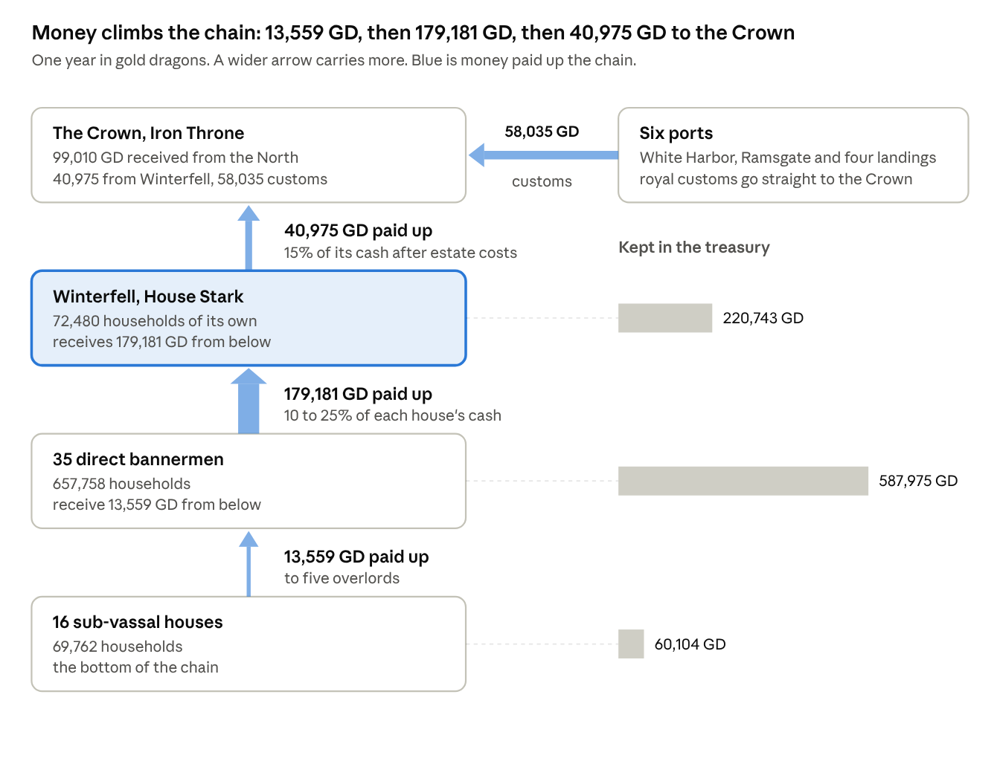

House Stark, one year, GD · from the workbook's House Accounts and Payments sheets.

Read from the bottom up. Each level pays the one above it, and the bars on the right show what each level keeps. The 35 direct bannermen keep 587,975 GD between them, more than twice what Winterfell keeps.

### Paid up to the Crown

Winterfell pays 15 percent of its cash receipts after estate costs, 40,975 GD, in two instalments of 24,585 and 16,390 GD. The Crown also collects royal customs at six ports, which go straight to it and never enter a house's account.

| Crown receipt from the North | Base (GD) | Rate | Collected | Received (GD) |
| --- | --- | --- | --- | --- |
| Winterfell's annual payment | 273,168 cash receipts | 15% | 100% | 40,975 |
| Customs, White Harbor | 1,893,362 turnover | 2.5% | 99% | 46,861 |
| Customs, Ramsgate | 227,203 turnover | 2.5% | 98% | 5,566 |
| Customs, Oldcastle landing | 104,135 turnover | 2.0% | 97% | 2,020 |
| Customs, Widow's Watch landing | 85,201 turnover | 2.0% | 97% | 1,653 |
| Customs, Flint's Finger landings | 75,734 turnover | 2.0% | 96% | 1,454 |
| Customs, Bear Island landings | 34,081 turnover | 1.5% | 94% | 481 |
| Total received by the Crown |  |  |  | 99,010 |

The 15 percent is charged on all of Winterfell's cash, including the tribute it collects. Measured against Winterfell's own estate and grain income of 93,987 GD, the payment is 43.6 percent. The Crown takes 3.0 percent of the North's output, and customs are 59 percent of what it takes.

### Immediate demands

Besides the Crown, the sheet records one fixed demand on Winterfell, the gift to the Night's Watch, paid in cash and in grain.

| Demand on Winterfell | Cash (GD) | Grain (quarters) |
| --- | --- | --- |
| Gift to the Night's Watch | 1,893 | 2,000: rye 800, barley 500, oats 400, peas and beans 200, wheat 100 |

The sheet adds no war levy, purveyance, confiscation windfall or marriage-pact income. Roads, bridges, landings and messengers are works the lord pays for himself, and appear under Household, castle and works.

### Collected from the bannermen

Each bannerman pays a fixed share of the cash he has available, from 25 percent (Manderly) down to 10 percent (Magnar, Crowl and Stane), in two instalments of 60 and 40 percent. Collection runs from 94 to 99 percent. Each house also passes up 10 percent of the grain rent it receives and 20 percent of any grain sent from houses beneath it; Winterfell receives 50,409 quarters this way.

| House (seat) | Households | Cash available (GD) | Rate | Due (GD) | Paid (GD) | Owing (GD) |
| --- | --- | --- | --- | --- | --- | --- |
| Manderly (White Harbor) | 99,661 | 152,542 | 25% | 38,135 | 37,754 | 381 |
| Bolton (Dreadfort) | 77,011 | 97,217 | 24% | 23,332 | 23,099 | 233 |
| Dustin (Barrowton) | 54,360 | 69,261 | 23% | 15,930 | 15,771 | 159 |
| Karstark (Karhold) | 49,830 | 63,947 | 22% | 14,068 | 13,928 | 141 |
| Umber (Last Hearth) | 45,300 | 52,599 | 20% | 10,520 | 10,204 | 316 |
| Ryswell (Rills) | 36,240 | 45,562 | 22% | 10,024 | 9,923 | 100 |
| Glover (Deepwood Motte) | 31,710 | 44,596 | 21% | 9,365 | 9,272 | 94 |
| Hornwood (Hornwood) | 31,710 | 40,805 | 22% | 8,977 | 8,887 | 90 |
| Tallhart (Torrhen's Square) | 27,180 | 34,978 | 21% | 7,345 | 7,272 | 73 |
| Cerwyn (Castle Cerwyn) | 27,180 | 35,757 | 22% | 7,867 | 7,788 | 79 |
| Locke (Oldcastle) | 22,650 | 29,976 | 22% | 6,595 | 6,529 | 66 |
| Flint of Flint's Finger | 18,120 | 23,879 | 20% | 4,776 | 4,728 | 48 |
| The other 23 direct bannermen | 136,806 | 166,963 | 10 to 18% | 24,637 | 24,027 | 610 |
| All 35 | 657,758 | 858,082 |  | 181,571 | 179,181 | 2,390 |

The first instalments bring in 107,509 GD and the second 71,673 GD. Rows are rounded. Manderly alone accounts for 21 percent of what is due, and the five largest houses for 56 percent.

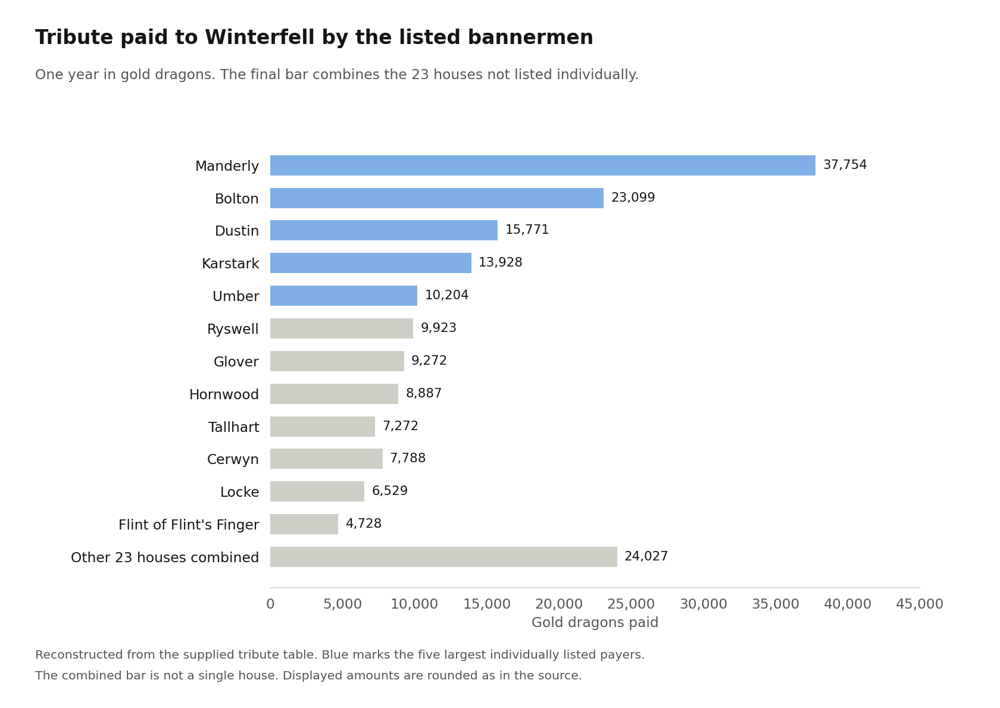

House Stark, one year, GD: cash paid by the twelve listed bannermen and the combined other twenty-three houses.

The blue bars are the five houses that carry most of the load. Each of the other 30 pays 5.5 percent of the total or less. The reconstructed chart shows the twelve individually listed houses and a separate combined bar for the other twenty-three; that final bar does not represent one house.

### Net tribute

Tribute is paid by one house and received by another, so it nets to zero across the North until it reaches the Crown. Winterfell is the one house that receives more than it pays.

| Level | Paid up (GD) | Received from below (GD) | Net tribute (GD) |
| --- | --- | --- | --- |
| 16 sub-vassal houses | 13,559 | 0 | -13,559 |
| 35 direct bannermen | 179,181 | 13,559 | -165,622 |
| Winterfell | 40,975 | 179,181 | +138,206 |
| The Crown, excluding customs | 0 | 40,975 | +40,975 |
| Sum |  |  | 0 |

Risk, deficits and contingency tests what a heavier Crown demand, or a failure of the bannermen to pay, would do to these figures.

## Household, castle and works

Winterfell's household, castle and works cost 11,450 GD, 4.2 percent of its cash receipts. The largest lines are building materials (2,745 GD), the Night's Watch gift (1,893), foot retainers (1,693) and non-grain provisions (1,518).

| Item | Quantity | Unit price (GD) | Cost (GD) |
| --- | --- | --- | --- |
| Foot retainers | 447 man-years | 3.787 | 1,693 |
| Mounted retainers | 45 man-years | 7.573 | 341 |
| Household servants | 82 person-years | 1.136 | 93 |
| Central account clerks | 21 person-years | 5.680 | 119 |
| Stewards | 4 person-years | 18.934 | 76 |
| Non-grain provisions | 4,010 ration-years | 0.379 | 1,518 |
| Livery and clothing | 595 person-years | 0.189 | 113 |
| Arms and armour upkeep | 492 armed retainer-years | 0.284 | 140 |
| Replacement riding horses | 5.4 head | 2.840 | 15 |
| Castle masons and carpenters | 41.2 craft worker-years | 5.680 | 234 |
| Building materials | 72,480 household-years | 0.0379 | 2,745 |
| Roads, bridges and landings | 72,480 household-years | 0.0189 | 1,372 |
| Messengers and official travel | 72,480 household-years | 0.0095 | 686 |
| Godswood care and alms | 72,480 household-years | 0.0057 | 412 |
| Cash gift to the Night's Watch | 1 gift | 1,893.36 | 1,893 |
| Total |  |  | 11,450 |

The household scales with the lordship. Foot retainers are 0.006 per household plus 12, mounted retainers 0.0006 per household plus 2, servants 0.001 plus 10, clerks 0.0003 plus 2, and stewards one plus one for every four estates. Works are charged as a small contribution per household.

Retainers, servants and estate workers also eat grain from the granary, 4,411 quarters a year for the household, which is in the grain account and not in this table. The standing force is 447 foot and 45 mounted retainers; the sheet fields no levy of bannermen because it assumes no war. Across the North the 52 houses spend 114,096 GD on household, castle and works, 3.5 percent of output.

## The annual account: charge and discharge

On the audit Winterfell is charged with 533,632 GD, discharges 62,889 GD, and carries forward 470,743 GD. The charge is everything the lord has to answer for: the opening treasury and every receipt. The discharge is everything he can show he paid out.

| Charge (GD) | Amount |
| --- | --- |
| Opening treasury, brought forward | 250,000 |
| Cash rents of tenants | 47,781 |
| Lord's share of livestock, wool and dairy | 27,178 |
| Mills, markets and courts | 8,330 |
| Timber and fishery leases | 4,873 |
| Grain sold from the granaries | 16,289 |
| Tribute from 35 bannermen | 179,181 |
| Receipts of the year | 283,632 |
| Total charge | 533,632 |

| Discharge (GD) | Amount |
| --- | --- |
| Estate running costs, paid before remittance | 10,464 |
| Household, castle and works | 9,557 |
| Gift to the Night's Watch | 1,893 |
| Paid to the Crown | 40,975 |
| Total discharge | 62,889 |
| Balance carried forward | 470,743 |

The year's surplus is 220,743 GD, which is receipts of 283,632 less the discharge of 62,889. The balance is cash only: it leaves out plate, land and stored produce, and arrears are receivables, not coin. Rows are rounded from exact figures.

The account is audited five ways:

1. Each estate receiver's gross receipts less his costs equals what he remitted: 88,162 less 10,464 is 77,698 GD.
2. Tribute received by Winterfell equals tribute paid by the 35 bannermen: 179,181 GD on both sides.
3. The Crown payment is 15 percent of cash receipts after estate costs: 15 percent of 273,168 is 40,975 GD.
4. The treasury rolls forward: 250,000 plus the surplus of 220,743 is 470,743 GD.
5. The grain account closes in quarters, shown under Where the harvest went.

## The seasonal calendar

Cash reaches Winterfell in two instalments, 60 percent and 40 percent, and the sheet fixes no dates for them. The stages below follow the sheet's order; the months are the house's to set.

| Stage | Cash in (GD) | Cash out (GD) | Treasury after (GD) |
| --- | --- | --- | --- |
| Opening treasury |  |  | 250,000 |
| First instalment: rents 28,669 and tribute 107,509 in; Crown 24,585 out | 136,178 | 24,585 | 361,593 |
| Second instalment: rents 19,113 and tribute 71,673 in; Crown 16,390 out | 90,785 | 16,390 | 435,988 |
| Through the year, undated: stock, leases, mills, markets, courts and grain sales in; estate costs, household and the Watch gift out | 56,670 | 21,914 | 470,743 |

Rows are rounded from exact figures, so a rent or tribute split may differ from its total by 1. Grain keeps its own calendar: the harvest fills the granary, seed is drawn for the next sowing, the retinue and workers draw food through the year, and Winterfell sells its surplus. That is in the grain account.

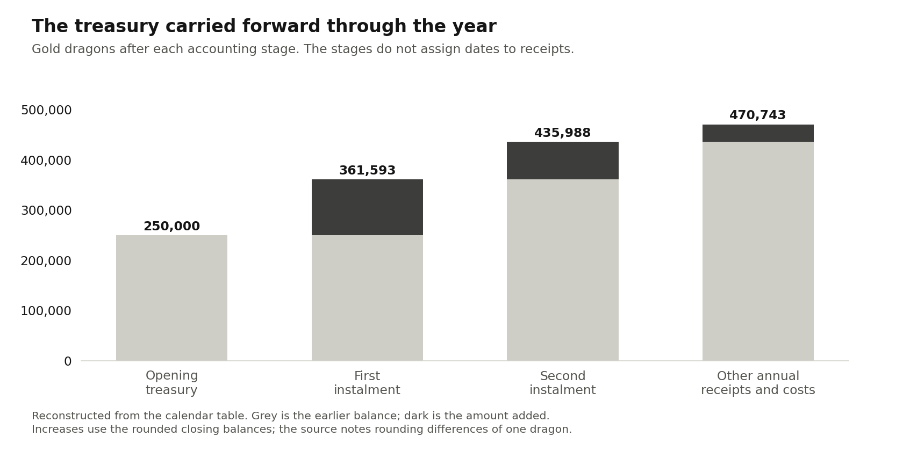

House Stark, one year, GD · same figures as the calendar table above.

Grey is what the treasury already held. Dark is what each step added once its outgoings were paid.

Three practical points follow from the stages:

1. After the first instalment alone Winterfell holds 361,593 GD against a year's outgoings of 62,889 GD, so it never has to borrow.
2. The Crown's two payments are covered at once: 24,585 GD falls due against 136,178 GD received in the same stage, and 16,390 GD against 90,785 GD.
3. Outgoings other than the Crown run through the year. If spread evenly they are about 1,826 GD a month, an assumption the sheet does not state.

## Risk, deficits and contingency

No stress test opens a cash deficit at Winterfell or at any other house. I recalculated the workbook under three changes to its own inputs, and the treasury stays well above zero in each.

| Test | Winterfell cash received (GD) | Paid to the Crown (GD) | Surplus kept (GD) | Closing treasury (GD) |
| --- | --- | --- | --- | --- |
| Base year | 273,168 | 40,975 | 220,743 | 470,743 |
| Rents remitted 15 percent instead of 2 | 254,820 | 38,223 | 205,147 | 455,147 |
| Bannermen pay half of what they now pay | 182,885 | 27,433 | 144,002 | 394,002 |
| Crown takes 25 percent instead of 15 | 273,168 | 68,292 | 193,426 | 443,426 |

The tests are mine, not the workbook's, and each changes one input. Forgiving rents costs Winterfell 15,596 GD of surplus. Half-payment by the bannermen costs 76,741 GD, but arrears across the North rise from 2,584 to 98,244 GD, and the Crown loses 13,542 GD because its share is a fixed 15 percent of Winterfell's cash. A 25 percent Crown share costs Winterfell 27,317 GD.

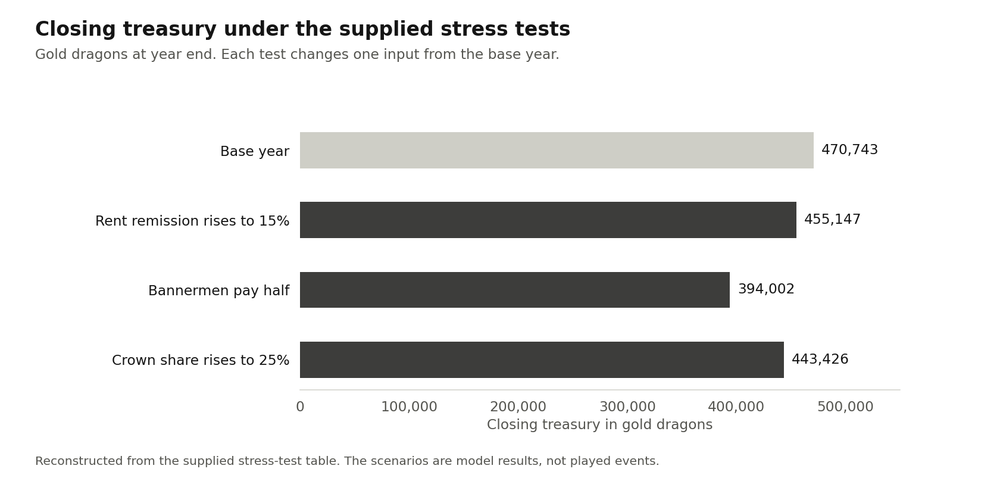

House Stark, one year, GD · stress tests on a copy of the workbook.

Bannermen paying half is the test that matters, because tribute is 66 percent of the cash Winterfell receives.

A harvest failure cannot be tested honestly in this sheet. Cutting every crop yield by 30 percent lowers the North's harvest from 11.41 to 7.98 million quarters. The sheet's market then imports 1.83 million quarters at unchanged prices and stops exporting 1.35 million. Because the sheet pins output at 3,300,000 GD, it also raises every price to compensate, so Winterfell's cash rents rise from 47,781 to 51,073 GD. Read that result as quantities only.

Three cautions follow:

1. Reserve. Winterfell opens with 250,000 GD, four years of its 62,889 GD outgoings, and ends the year with seven and a half.
2. Concentration. Manderly owes 38,135 GD, 21 percent of the tribute and 14 percent of Winterfell's cash. The five largest houses owe 56 percent.
3. Arrears. Tenants owe 1.9 percent of Winterfell's cash rent after remission and bannermen 1.3 percent of tribute. Small arrears are cheap to collect and dear to forget.

## Where the harvest went: the grain account

Winterfell's granary starts the year with 70,777 quarters, takes in 338,087 more, uses 100,250, sells 236,735 and ends with 71,879. Grain is kept in quarters and never mixed with the cash account.

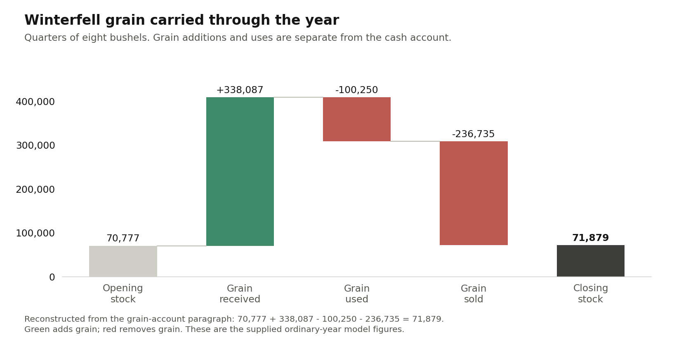

Winterfell, one year, quarters of 8 bushels · the grain account.

Winterfell sends no grain to the Crown; it sends cash. It buys no grain.

| Crop | Stock before market (q) | Sold (q) | Sold for (GD) | Closing stock (q) |
| --- | --- | --- | --- | --- |
| Rye | 87,821 | 69,941 | 4,414 | 17,880 |
| Barley | 82,959 | 63,730 | 4,597 | 19,228 |
| Oats | 75,393 | 52,564 | 2,370 | 22,829 |
| Peas and beans | 38,165 | 30,808 | 2,778 | 7,357 |
| Wheat | 24,276 | 19,692 | 2,131 | 4,584 |
| Total | 308,614 | 236,735 | 16,289 | 71,879 |

Across the North the harvest is 11,405,588 quarters. Seed takes 3,615,871, food for 4,000,000 people 4,400,000, animal feed 445,600 and loss 929,859. The North exports 1,347,318 quarters, imports none, and adds 664,940 to stock, which closes at 7,182,803 quarters. Rows are rounded.

## Glossary of terms

The terms this sheet uses, in alphabetical order, in plain words.

| Term | Meaning |
| --- | --- |
| Arrears | Rent or tribute owed and not yet paid. A receivable, not coin in the chest |
| Bannerman | A house sworn to a higher house, which pays it tribute |
| Cash available | A house's net estate cash, grain sales, harbour dues and tribute received; the base for what it pays up |
| Charge and discharge | The account form: what the lord is charged with, less what he can show he paid out |
| Collection rate | The share of what is due that is actually paid, 90 to 99 percent by district |
| Crown payment | Winterfell's yearly cash to the Iron Throne: 15 percent of its cash receipts after estate costs |
| Customs, royal | The Crown's duty on port trade, collected at the port and never passing through a house |
| Demesne | The one-fifth share of farm output the lord keeps; tenants hold the other four fifths |
| Estate | A group of villages, fields and leases under one receiver; Winterfell has 12, the North 163 |
| GD | Gold dragon, worth 210 stags; the unit of every cash account |
| Godswood | The grove of the old gods; its care and alms are a cost, not a tithe |
| Harbour dues, local | A rate on port trade kept by the house that holds the port |
| Holding class | Full farm, smallholding, croft and cottage, or town plot; it sets the rent |
| Instalment | A payment in two parts, 60 percent then 40 percent |
| Output | Value added in the year; rents and tribute move it between hands and are never added to it |
| Quarter | Eight bushels of grain; the unit of every grain account |
| Receiver | The officer who collects an estate's cash and remits it to the house |
| Remission | The lawful 2 percent cut from assessed rent before it is collected |
| Retained cash | What a house keeps after costs and payments up: its surplus for the year |
| Rural household | A household that farms; it sows 14 acres. Town households do not |
| Stag | Silver coin of 56 pennies, 1/210 of a dragon |
| Sub-vassal | A house that pays another bannerman and not Winterfell directly |
| Tithe | A tenth of produce owed to a church; none is levied in the North |
| Treasury | A house's stock of coin; opening and closing balances are cash only |
| Tribute | Cash paid up the chain from a lower house to a higher one |

Old English terms such as scutage, purveyance, relief and wardship have no entry because the sheet's ordinary year contains none of them.

## Notes, assumptions and variation

Every figure comes from the North 126 AC fiscal model and is a simulation choice, not a record. The houses and their documented allegiances are the setting; the rents, prices, shares and household counts are the model's. The cash scale is the model's own: 3,300,000 GD of output for the North, and every figure here sits on it.

| Assumption | Value |
| --- | --- |
| North output | 55% of the 6,000,000 GD Westerlands benchmark, 3,300,000 GD |
| People per household | 5 |
| Grain food per person | 1.1 quarters a year |
| Demesne share of farm output | 20% |
| Sown acres per rural household | 14 |
| Harvest loss | 5% of the gross harvest |
| Tenant grain rent | 7% of the tenant harvest |
| Lawful remission of rents | 2% |
| Winterfell's payment to the Crown | 15% of cash receipts after estate costs |
| Cash instalments | 60% then 40% |
| Gift to the Night's Watch | 2,000 quarters and 1,893 GD a year |
| Coin and measure | 210 stags to the dragon, 56 pennies to the stag, 8 bushels to the quarter |

Four things to bear in mind when reading the figures:

1. Prices follow output. They are scaled so the North's output hits 3,300,000 GD, and households, acres and quarters are typed in, so changing the 55 percent rescales every GD figure and no quantity.
2. Port turnover is a typed assumption, not derived from the grain the North sells, and royal customs, 59 percent of the Crown's take, rest on it.
3. The Crown's 15 percent is charged on all of Winterfell's cash, tribute included.
4. Every rural household sows 14 acres whatever its holding class, so a croft pays a seventh of a full farm's rent for the same acreage.

What the sheet leaves out by rule: any general tithe, the Gift and New Gift, a war levy, confiscation windfalls, new mines, any 129 AC income, debt and interest. Cash balances exclude plate, land and stored produce. There is no cash account for tenant households.

To adapt the sheet to another house, change the Crown share, then the bannermen's rates, then the rent per holding class, in that order. They move the surplus most.

## Chart preservation

The Word and Markdown uploads contained the same text and all 29 tables. This single reference preserves that content and the eight chart images present in the Word file. The charts are static exports; any hover instructions printed inside an original image do not provide interactive values here.

Four chart images were absent from both exports. Their replacements are labeled as reconstructions: bannerman payments use the supplied tribute table, the treasury calendar uses its listed closing balances, the stress tests use their table, and the grain account uses the five quantities stated in its opening paragraph. The twenty-three unnamed bannermen remain grouped because their individual payments were not supplied. Rounding and all model assumptions remain as stated in the source.
